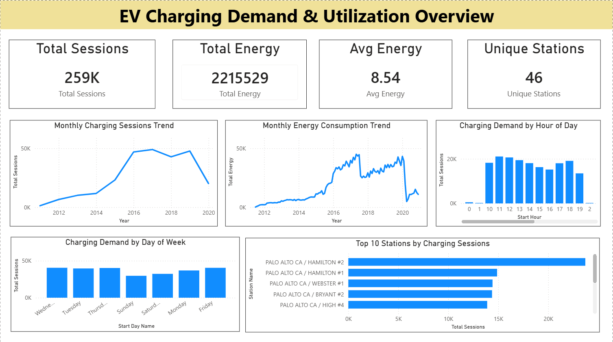
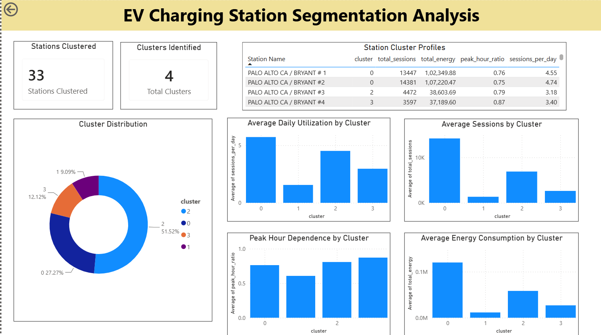
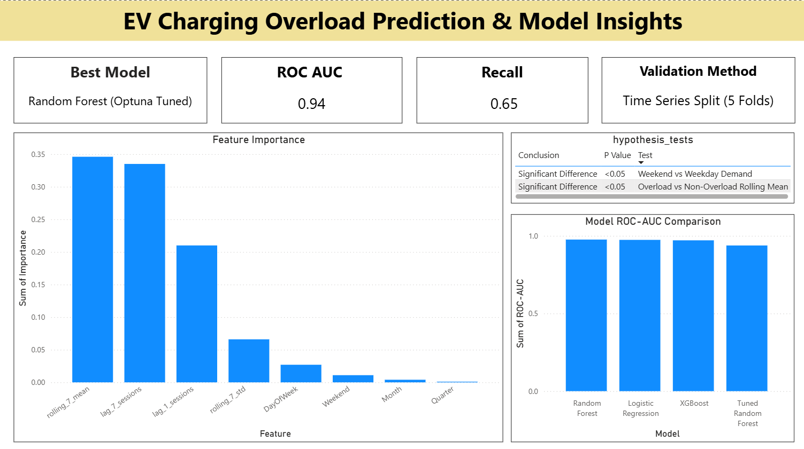

# EV Charging Demand Analytics & Overload Prediction

## Project Overview

Electric Vehicle (EV) adoption has increased significantly over the last decade, creating higher demand on public charging infrastructure. Efficient utilization of charging stations is essential to reduce congestion, improve user experience, and support future infrastructure planning.

This project analyzes over 259,000 EV charging sessions from the City of Palo Alto charging network. The project combines exploratory data analysis, station segmentation, overload prediction, statistical validation, and interactive Power BI dashboards to generate actionable business insights.

---

## Business Problem

EV charging stations experience varying levels of utilization across locations, time periods, and user behavior patterns.

The objectives of this project were:

- Understand charging demand trends over time.
- Identify different types of charging stations using clustering.
- Detect factors influencing charging station utilization.
- Predict potential station overload events.
- Provide actionable business recommendations through an interactive dashboard.

---

## Dataset

**Source:** City of Palo Alto EV Charging Stations Dataset

### Dataset Summary

| Metric | Value |
|----------|----------|
| Total Charging Sessions | 259,366 |
| Charging Stations | 46 |
| Time Period | 2011 - 2020 |
| Features | 33+ |
| Data Type | Time Series |

---

## Tech Stack

### Programming & Analysis

- Python
- Pandas
- NumPy
- SciPy

### Machine Learning

- Scikit-Learn
- XGBoost
- Optuna

### Visualization

- Matplotlib
- Seaborn
- Power BI

### Version Control

- Git
- GitHub

---

## Project Workflow

```text
Data Collection
        ↓
Data Cleaning
        ↓
Exploratory Data Analysis
        ↓
Station Segmentation (KMeans Clustering)
        ↓
Feature Engineering
        ↓
Overload Prediction
        ↓
Hyperparameter Tuning (Optuna)
        ↓
Statistical Validation
        ↓
Power BI Dashboard
```

---

## Exploratory Data Analysis

The analysis focused on:

- Charging demand trends over time
- Energy consumption patterns
- Station utilization behavior
- Hourly charging demand
- Weekday vs weekend demand
- Station-level performance analysis

### Key Findings

- Charging demand increased significantly between 2011 and 2017.
- Peak charging activity occurs during daytime hours.
- Utilization patterns vary substantially across stations.
- Charging demand differs significantly between weekdays and weekends.

---

## Station Segmentation

Charging stations were segmented using **KMeans Clustering** based on utilization and energy consumption characteristics.

### Features Used

- Total Sessions
- Total Energy
- Average Energy
- Average Charging Time
- Average Total Duration
- Sessions Per Day
- Peak Hour Ratio
- Active Days

### Results

- Identified **4 distinct station clusters**
- Segmented stations into different utilization groups
- Revealed high-demand and low-demand station categories

---

## Overload Prediction

A classification model was developed to predict potential charging station overload events.

### Target Variable

An overload event was defined when:

```python
sessions_count >= 11
```

### Feature Engineering

Created:

- Lag Features
    - lag_1_sessions
    - lag_7_sessions

- Rolling Features
    - rolling_7_mean
    - rolling_7_std

- Calendar Features
    - Month
    - Quarter
    - Day of Week
    - Weekend Indicator

### Models Evaluated

- Logistic Regression
- AdaBoost
- Random Forest
- XGBoost

### Validation Strategy

Time-series data requires chronological validation.

Used:

- TimeSeriesSplit (5 folds)

instead of random train-test splitting.

### Hyperparameter Tuning

Optuna was used to optimize Random Forest parameters.

Best Parameters:

```text
n_estimators      = 300
max_depth         = 20
min_samples_split = 10
min_samples_leaf  = 8
max_features      = log2
```

### Final Model Performance

| Metric | Value |
|----------|----------|
| ROC-AUC | 0.94 |
| Recall | 0.65 |
| F1 Score | 0.44 |

---

## Feature Importance

The most important predictors of overload events were:

| Feature | Importance |
|----------|----------|
| rolling_7_mean | 0.346 |
| lag_7_sessions | 0.335 |
| lag_1_sessions | 0.210 |
| rolling_7_std | 0.066 |
| DayOfWeek | 0.027 |
| Weekend | 0.011 |
| Month | 0.004 |
| Quarter | 0.001 |

### Insight

Historical demand patterns are the strongest predictors of future overload events.

---

## Statistical Validation

### Hypothesis Test 1

**Question:**
Does charging demand differ between weekdays and weekends?

**Test Used:** Mann-Whitney U Test

**Result:** Significant Difference (p < 0.05)

---

### Hypothesis Test 2

**Question:**
Does rolling average demand differ between overload and non-overload events?

**Test Used:** Mann-Whitney U Test

**Result:** Significant Difference (p < 0.05)

---

## Power BI Dashboard

A three-page interactive dashboard was developed to communicate insights.

### Dashboard Pages

### 1. Demand Overview

- Total Sessions
- Total Energy
- Average Energy
- Monthly Demand Trends
- Hourly Demand Analysis
- Day-of-Week Analysis
- Top Charging Stations



---

### 2. Station Segmentation Analysis

- Cluster Distribution
- Sessions by Cluster
- Energy Consumption by Cluster
- Utilization by Cluster
- Station Cluster Profiles



---

### 3. Overload Prediction & Model Insights

- Model Performance Metrics
- Feature Importance
- Hypothesis Testing Results
- Business Recommendations



---

## Repository Structure

```text
ev-charging-demand-segmentation/
│
├── data/
│   ├── raw/
│   └── processed/
│
├── notebooks/
│   ├── 01_data_understanding.ipynb
│   ├── 02_data_cleaning.ipynb
│   ├── 03_eda.ipynb
│   ├── 04_feature_engineering_and_clustering.ipynb
│   ├── 05_overload_prediction_modeling.ipynb
│   └── business_insights_and_statistical_validation.ipynb
│
├── model/
│   └── rf_tuned_model.joblib
│
├── reports/
│   ├── dashboard_page1.png
│   ├── dashboard_page2.png
│   └── dashboard_page3.png
│
├── requirements.txt
├── README.md
└── .gitignore
```

---

## Business Recommendations

- Prioritize infrastructure upgrades for high-utilization stations.
- Monitor stations with high peak-hour dependence.
- Use overload prediction models for proactive resource planning.
- Expand charging capacity at stations with consistently high utilization.
- Incorporate real-time monitoring for operational decision-making.

---

## Future Improvements

- Real-time overload monitoring
- Demand forecasting models
- Cloud deployment using AWS
- Automated alerting system
- Integration with live charging station APIs

---

## Author

**Omkar Lone**

<<<<<<< HEAD
GitHub: https://github.com/omkar-1210
=======

GitHub: https://github.com/omkar-1210
>>>>>>> 5fe3f60 (Add Power BI dashboard and project documentation)
